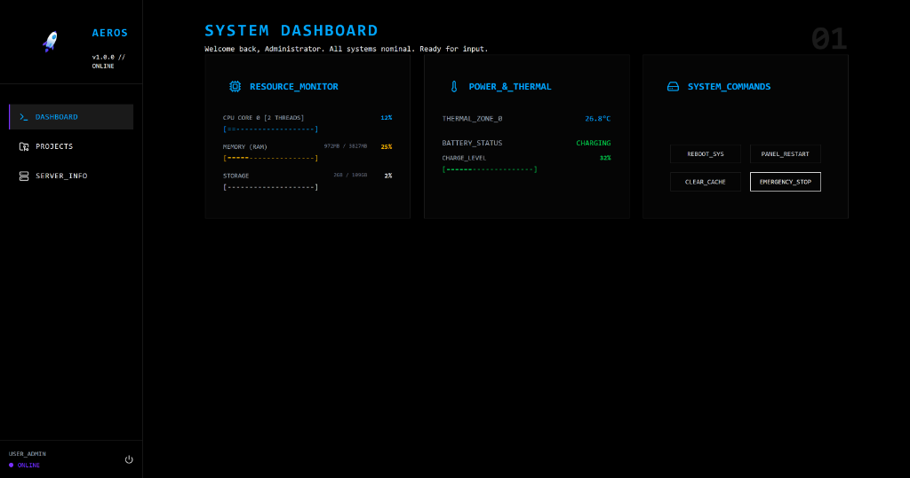
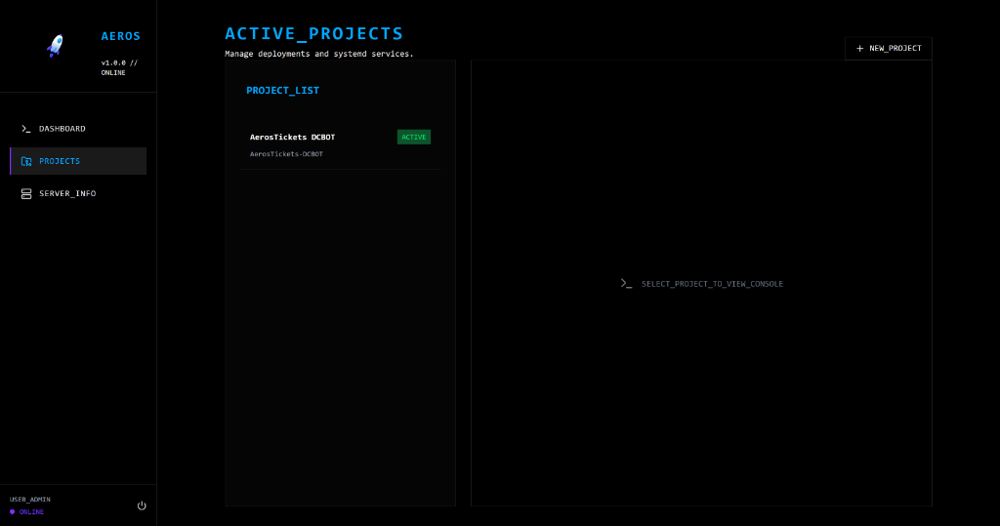
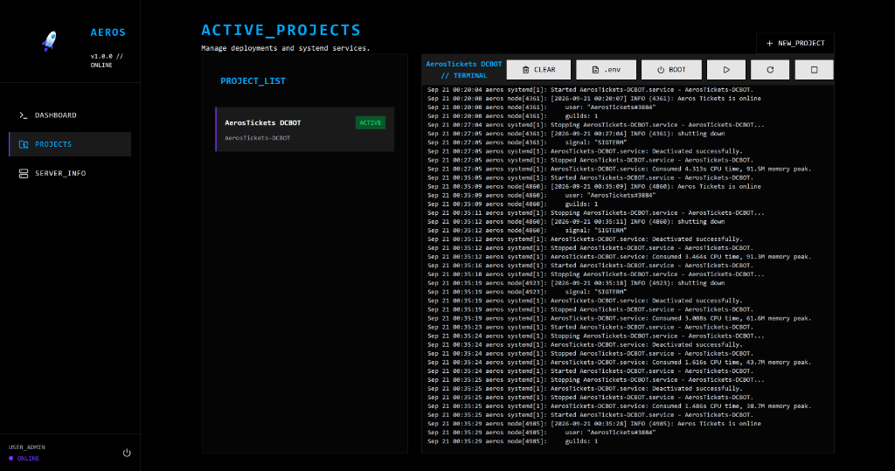
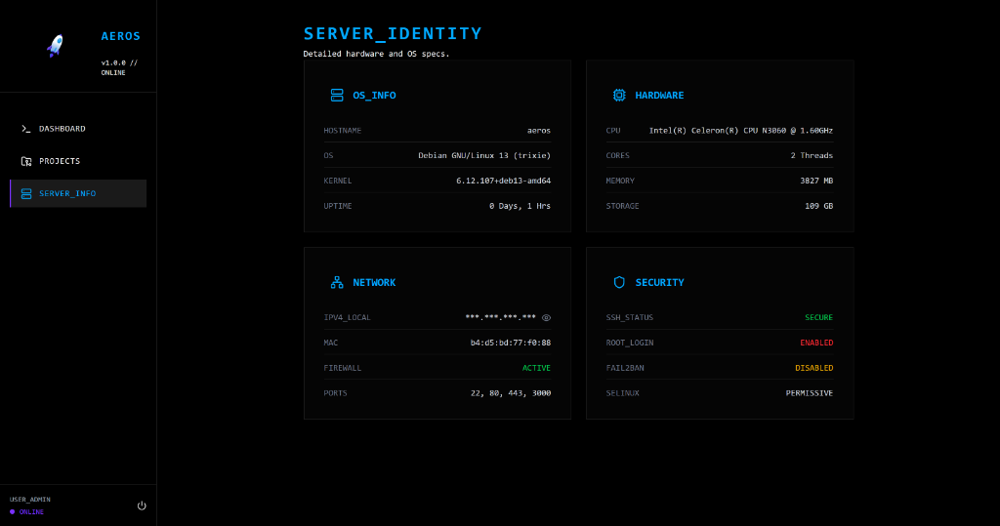

# AerosPanel

A zero-overhead, hyper-optimized control panel designed specifically for managing Debian-based Discord bots and system services on low-resource hardware.

## Screenshots






Unlike heavy alternatives like Coolify or Pterodactyl that rely on Docker and complex proxies, AerosPanel interfaces directly with native Linux tools to keep the hardware footprint at absolute zero when idle.

## 🔥 Features
- **Zero Configuration**: No complex setup. Drop the backend into your server and run.
- **Hardware Telemetry**: Native reads from Linux `/sys/class/` sensors for zero-overhead metrics.
- **Systemd Integration**: Wraps `systemctl` to manage bots/services at the OS level.
- **Terminal Streaming**: Streams standard output directly to your browser via WebSockets.
- **.env Editor**: Edit project environment variables directly from the panel.
- **Autostart Control**: Toggle whether specific services should start automatically on boot.
- **Ultra-lightweight**: Compiles down to a minimal footprint, serving static files without requiring a heavy dev server.

## 🛠️ Tech Stack
- **Frontend**: React 19, TypeScript, Vite, TailwindCSS v4, Terminal.css, Lucide React.
- **Backend**: Node.js, Express, TypeScript, SQLite3 (Knex), `ssh2`, native `systemctl` bindings.
- **Deployment**: Custom automated SSH scripts, PM2/Systemd integration.

## Architecture

- **Backend**: Node.js + Express + TypeScript + SQLite (Easily swap to MySQL via Knex).
- **Frontend**: React + Vite + Tailwind CSS v4.

## Setup & Development

### 1. Backend (Linux Agent)
```bash
cd backend
npm install
npm run dev
```

### 2. Frontend (Dashboard)
```bash
cd frontend
npm install
npm run dev
```

## License
Open-source project built for optimal resource utilization.
